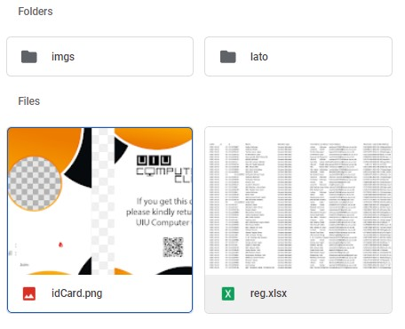
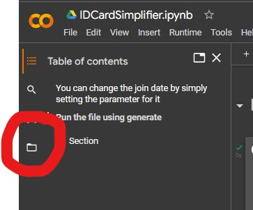

# Auto ID Card Generator

This is an auto ID card generator program. This will read an excel file and find the picture from the google drive from each row and create an ID card with the template ad shown below: 


The picture of the ID card: \
</img>

# Steps:

This was optimized for running on local machines, and on Google Colab. Here are the specifications for running on a local machine, and on a Google Colab environment:

## Working with your local machine environment:
- Clone this repository with `git clone https://github.com/raidenblackout/AutoIDCardGenerator`
- **IMPORTANT: Assign `IS_GDRIVE = False` before running the notebook**
- Load the member datasheet file
  - NOTE: while loading the file, ensure there are 4 fixed columns: **Name**, **ID**, **Email Address**, **Blood Group**, **Member Type** (with these headers)
- Download the images as a directory and place it in the root directory with this file. The path for one image **MUST** be accessible as `imgs/109230249.png`
- In the `generate()` function, pass the filename you want to generate the ID cards from.
  - `generate(filename(string), test=False(boolean), length=10(integer))`
    - `filename`: the path of the excel file
    - `test`: optional, if you want to conduct a test on the data to see its output
    - `length`: optional and works with `test`, set the range of test examples you want to generate
- The generate IDs are now outputted in the ids directory located in the root directory of the project

## Working with Google Colab environment:

**Note: Before working, there should be a folder in your Google Drive named 'AutoIDCardGenerator'. 
The drive must be set-up as follows:**
</img>
```diff 
+ The imgs folder will contain all the images of the people
+ The lato folder will contain the ttf files as same as the lato folder in this repository
+ The excel file and the idCard image file
- collect the content of the imgs and the excel sheet from the authorized persons.
```
- Download the [notebook](IDCardSimplifier.ipynb)
- Upload to your Google Colab
- **IMPORTANT: Assign `IS_GDRIVE = True` before running the notebook**
- Connect and Mount your Google Drive
- run the file
- there should be an `ids` folder located in the `/content` folder (the default folder found). To find it: \
  </img>